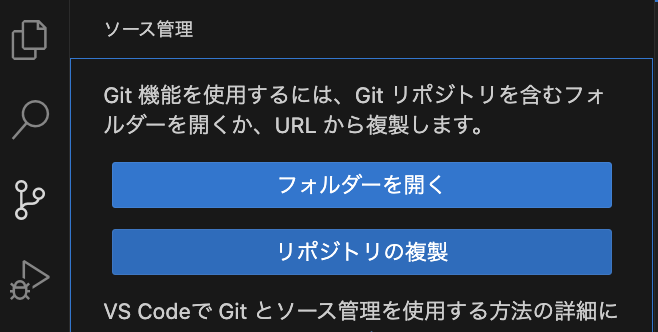
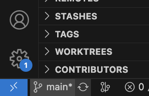
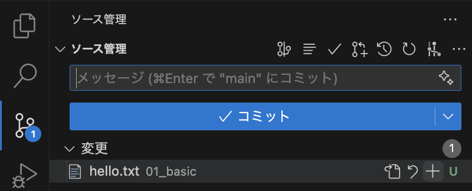
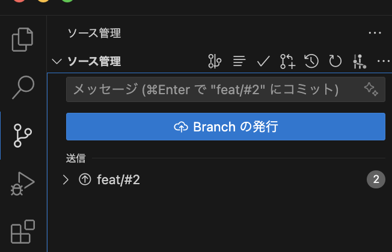

# git操作をVSCodeで行う

## clone

VScodeの左のメニューから、`Source Control`を選択し、`Clone Repository`を選択します。
リポジトリのURL(ssh)を入力し、保存先を選択します。

## ブランチの切り替え

VScodeの左下にブランチ名（はじめはmain）が表示されています。
クリックすると、切り替えることができます。
作成もここから行うことができます。

## コミット

`Source Control`から、`+`をクリックし、コミットしたいファイルをステージに上げます。
ステージとは、コミットするファイルを選択することです。

コミットメッセージを入力し，コミットボタンを押すと、コミットが完了します。

## プッシュ

`Source Control`から、`branchの発行`をクリックしてsshキーのパスフレーズを入力します。

## プルリクエスト（PR）

githubの拡張機能をインストールすると、VScode上でプルリクエストを作成することができます。

`Github Pull Request`で検索してみて下さい．
